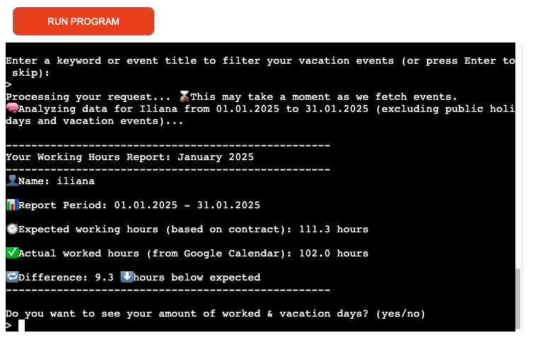

# Working Hours Analyser

## Introduction

This application was developed as a personal solution to gain clear and accurate tracking of my working hours, particularly because I work with flexible schedules and freelance projects. Existing tools either lack smooth integration with Google Calendar or require cumbersome manual entry in spreadsheets. This tool bridges that gap by automatically connecting to your Google Calendar, calculating your actual hours worked versus contract hours, tracking vacation and holiday days, and providing detailed reports — all tailored to flexible work patterns.

visit live:
https://working-hours-analyser-1a0bd1b9ba29.herokuapp.com/
---

## Features

- Connects seamlessly to Google Calendar via a service account  
- Calculates actual hours worked vs. contract hours over any reporting period  
- Supports filtering work events by keywords  
- Includes vacation and public holiday days in analysis  
- Handles flexible working weeks (Mon–Fri, Mon–Sat, flexible, or custom)  
- Manages all-day events with configurable counting policies (omit, 8hr, 24hr)  
- Provides detailed shift lists and summary reports  
- Handles API pagination to fetch all events reliably  

---

## Technologies Used

- Python 3.x  
- Google Calendar API (`google-api-python-client`)  
- Google Sheets API (`gspread`)  
- OAuth2 credentials via `google.oauth2.service_account`  
- `holidays` package for country-specific public holidays  
- Heroku for deployment  

---

## Object-Oriented Design Approach

The application is designed with OOP principles to ensure maintainability, extensibility, and clear separation of concerns:

- **Encapsulation**: Each class manages its own data and behavior.  
- **Abstraction**: The rest of the app interacts with calendar classes through simple interfaces without knowing the internal fetching/filtering details.  
- **Single Responsibility**: Classes have focused roles:  
  - `User` stores user-specific info (name, contract hours, working days, country code).  
  - `Calendar` is a base class encapsulating calendar ID and event fetching.  
  - `WorkCalendar` and `VacationCalendar` extend `Calendar` with specialized methods to fetch, filter, and analyze shifts or vacation events.  
  - `HolidayCalendar` wraps the `holidays` library for public holiday handling.  
  - `Report` aggregates data from calendars and user input to compute hours worked, days worked, surplus/deficit, and generate formatted reports.  
- **Inheritance & Polymorphism**: Calendar subclasses share a common interface, making the code extensible for new calendar types without massive refactoring.

This design ensures that adding new features, calendar types, or data sources can be done cleanly without disrupting existing logic.

---

## Development and Testing Workflow

### Initial Setup and API Integration

- Created a Google Cloud project, enabled Google Calendar, Drive, and Sheets APIs.  
- Generated a service account, downloaded `creds.json`, and shared calendars with the service account’s email.  
- Installed and configured Python dependencies including `google-api-python-client`, `gspread`, and `holidays`.  
- Set up authorization and scoped credentials for calendar and spreadsheet access.  

### Development Phases

1. **Dependency Connection Test**  
   - Created a standalone `test.py` script to verify successful connection to Google Calendar and Google Sheets APIs, both locally and after Heroku deployment.  

2. **User Class Development**  
   - Encapsulated all user-specific inputs like name, contract hours, working week pattern, and country code.  
   - Tested input validation locally and remotely.  

3. **Base Calendar Class**  
   - Implemented general calendar methods: event fetching by period, event filtering by title keyword.  
   - Incorporated pagination handling for Google Calendar API to ensure all events are retrieved.  

4. **WorkCalendar Subclass**  
   - Added methods for fetching filtered work shifts, calculating total worked hours, and counting unique worked days.  
   - Resolved bugs related to filtering and date clipping for shifts spanning outside report ranges.  
   - Tested functionality against personal calendar data for accuracy.  

5. **VacationCalendar Subclass**  
   - Mirrored work calendar event fetching and filtering logic for vacation events.  
   - Developed date clipping logic to count only vacation days within the reporting period.  
   - Handled overlap between vacation days and public holidays.  

6. **HolidayCalendar Wrapper**  
   - Integrated the `holidays` package for country-specific public holidays.  
   - Provided methods to fetch and count holidays within a period, filtered by working weekdays.  

7. **Report Class**  
   - Combined user data and calendar data to compute expected contract hours, actual worked hours, surplus/deficit, days worked, vacation days (minus overlapping holidays), and total days off.  
   - Generated formatted summary and detailed shift lists.  
   - Added error handling and input validations.  
   - Implemented a CLI flow with guided user prompts and real-time validation for calendar IDs and filters.  
   - Included a report loop for generating multiple reports in a session with options to reuse or reset calendars.  

### Testing

- Tested each class and method locally with mock and real calendar data.  
- Deployed on Heroku and tested end-to-end user flow including authentication, event fetching, and report generation.  
- Verified proper handling of edge cases such as all-day events, long date ranges, and API pagination.  
- Used multiple test calendars with real data (personal and shared test calendars) to ensure realistic performance and accuracy.  
- Validated input fields for dates, calendar IDs, contract hours, and weekday selections.  
- Fixed bugs found during testing such as:  
  - Incorrect filtering logic for event titles.  
  - Inaccurate worked days count when shifts overlap reporting periods.  
  - Missing events due to API pagination limits.  
  - Handling of overlapping vacation and holiday days.  
- Ensured graceful handling of API errors and invalid inputs with user-friendly messages and restart options.  

---

## Future Improvements

- Allow custom manual input for all-day event hours beyond preset options.  
- Add sick days tracking with validation based on local regulations or doctor notes.  
- Implement time-related bonuses for after-hours or weekend work, customizable per country.  
- Enhance real-time input validation and confirmation prompts to avoid user errors.  
- Add export options: Google Sheets, JSON API, PDF reports.  
- Extend calendar integration beyond Google Calendar (e.g., CalDAV).  
- Add a web-based GUI for easier interaction.  
- Implement authentication flow for direct calendar connection by the user.  

---

## Getting Started

### Prerequisites

- Python 3.8+  
- Google Cloud Project with Calendar, Drive, and Sheets APIs enabled  
- Service Account with `creds.json` and calendar sharing set up  
- Installed Python dependencies from `requirements.txt`  

### Installation

git clone <repo-url>
cd working-hours-analyser
python -m venv .venv
source .venv/bin/activate  # On Windows: .venv\Scripts\activate
pip install -r requirements.txt
Running Locally
git clone <repo-url>
cd working-hours-analyser
python -m venv .venv
source .venv/bin/activate  # On Windows: .venv\Scripts\activate
pip install -r requirements.txt

### Runnung locally

python run.py
Follow the guided prompts in the terminal to input your user info, calendar IDs, contract hours, and report period.

### Deployment

Push to Heroku (or another cloud platform).

Set environment variables and upload creds.json securely.

Ensure service account has calendar access.

Run python run.py via the Heroku console or deploy as a web service.

### Testings Calendars Provided

Iliana’s Work Calendar: vcrk5gevoffaskkl57rbl3q1n8@group.calendar.google.com

Cesar’s Work Calendar: 66bf19679262cea6dda330aa828b21fcd59399f1fe0969130117b726fac70ced@group.calendar.google.com

Angela’s Calendar: s2msasa4r6ppgpauhjt9h0enu8@group.calendar.google.com (ends 28.02.2025)

Vacation Calendar: 11knrbjev3res0paa1gkcuq9js@group.calendar.google.com (keywords: urlaub cesar, urlaub iliana, urlaub angela)

To test with your own calendar, grant the service account email working-hours-analyser-sa@working-hours-analyser.iam.gserviceaccount.com at least "See all event details" permission.